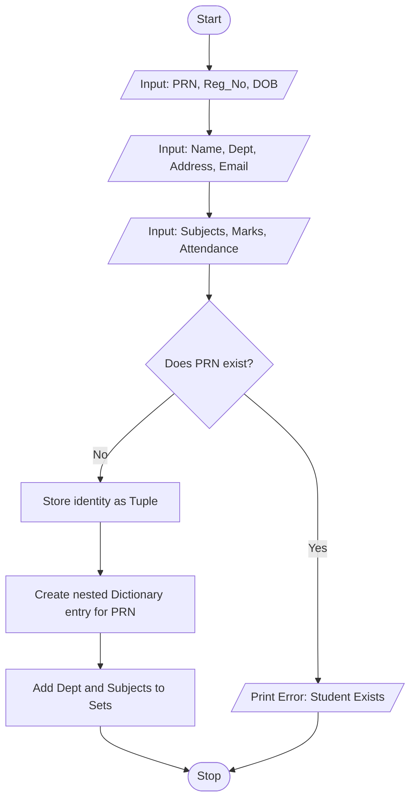
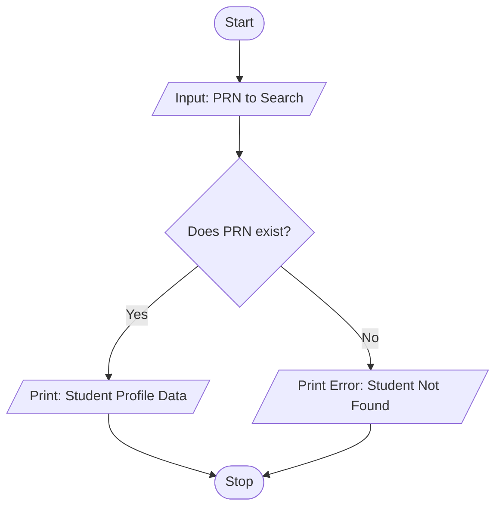
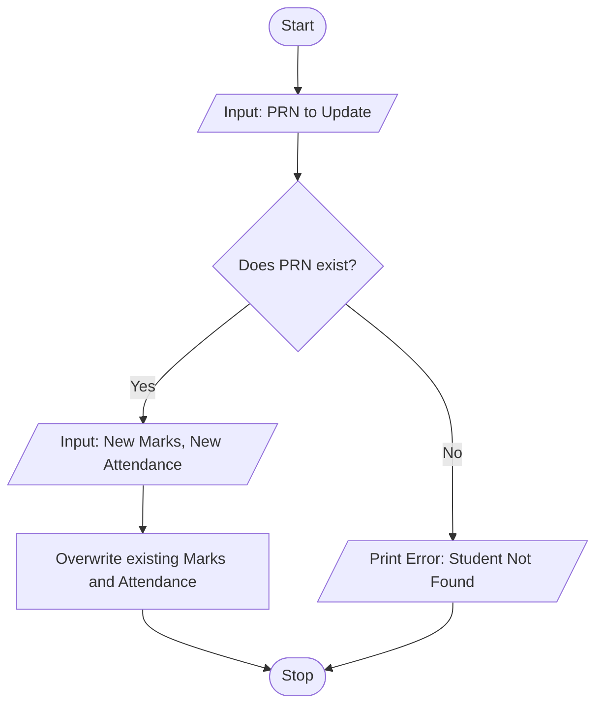
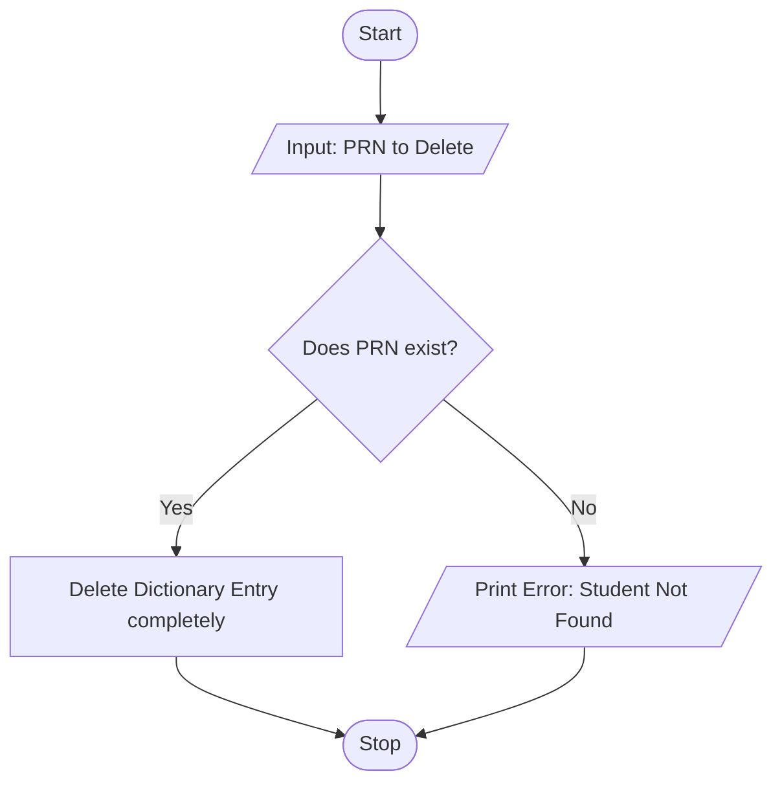
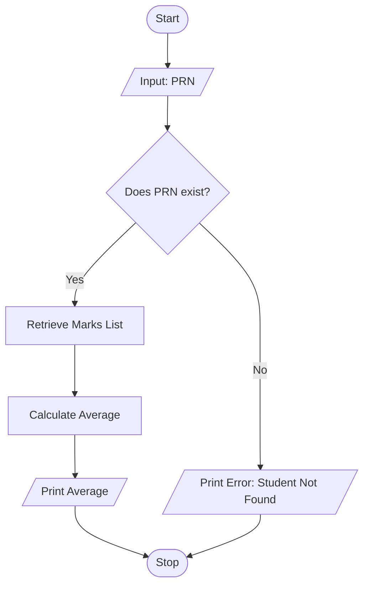

# System Flowcharts

## 1. Add Student

```mermaid
graph TD
    A([Start]) --> B[/Input: PRN, Reg_No, DOB/]
    B --> C[/Input: Name, Dept, Address, Email/]
    C --> D[/Input: Subjects, Marks, Attendance/]
    D --> E{Does PRN exist?}
    E -- Yes --> F[/Print Error: Student Exists/]
    E -- No --> G[Store identity as Tuple]
    G --> H[Create nested Dictionary entry for PRN]
    H --> I[Add Dept and Subjects to Sets]
    I --> J([Stop])
    F --> J
```

## 2. Search Student

```mermaid
graph TD
    A([Start]) --> B[/Input: PRN to Search/]
    B --> C{Does PRN exist?}
    C -- Yes --> D[/Print: Student Profile Data/]
    C -- No --> E[/Print Error: Student Not Found/]
    D --> F([Stop])
    E --> F
```

## 3. Update Record

```mermaid
graph TD
    A([Start]) --> B[/Input: PRN to Update/]
    B --> C{Does PRN exist?}
    C -- Yes --> D[/Input: New Marks, New Attendance/]
    D --> E[Overwrite existing Marks and Attendance]
    C -- No --> F[/Print Error: Student Not Found/]
    E --> G([Stop])
    F --> G
```

## 4. Delete Record

```mermaid
graph TD
    A([Start]) --> B[/Input: PRN to Delete/]
    B --> C{Does PRN exist?}
    C -- Yes --> D[Delete Dictionary Entry completely]
    C -- No --> E[/Print Error: Student Not Found/]
    D --> F([Stop])
    E --> F
```

## 5. Calculate Average

```mermaid
graph TD
    A([Start]) --> B[/Input: PRN/]
    B --> C{Does PRN exist?}
    C -- Yes --> D[Retrieve Marks List]
    D --> E[Calculate Average]
    E --> F[/Print Average/]
    C -- No --> G[/Print Error: Student Not Found/]
    F --> H([Stop])
    G --> H
```